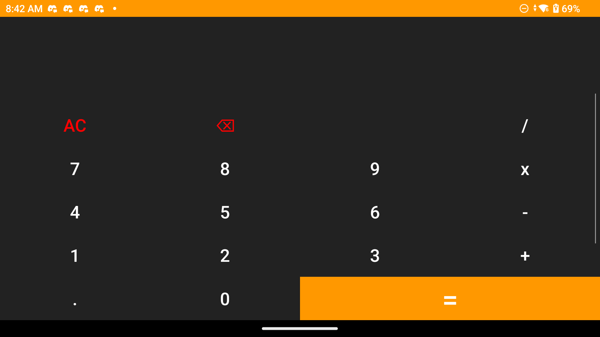

# CalculateThis

A simple, clean calculator app for Android built with Kotlin.

*The calculator running on an Android device — dark keypad with AC/backspace, digits, operators, and the orange equals key.*

## Features
- Basic arithmetic: addition, subtraction, multiplication, division
- Clear and backspace controls
- Clean, minimal UI

## Tech Stack
- **Language**: Kotlin
- **Platform**: Android
- **Build**: Gradle / Android Studio

## Getting Started
1. Clone the repo
2. Open in Android Studio
3. Build and run on an emulator or physical device
